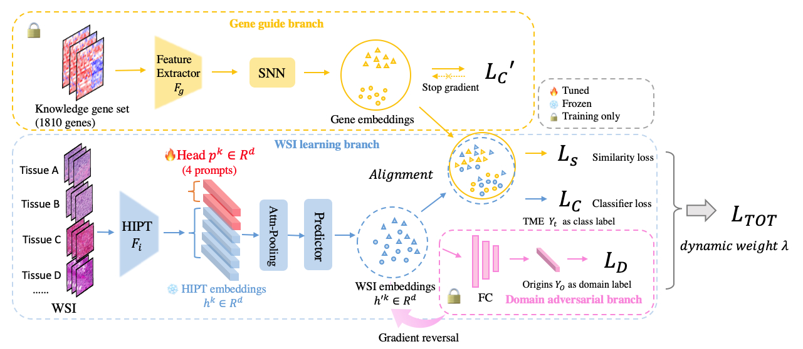

## PathoTME

## Genomics-guided Representation Learning for Pathologic Pan-cancer Tumor Microenvironment Subtype Prediction (*MICCAI 2024*)

[Paper Link](https://doi.org/10.48550/arXiv.2406.06517)

## Workflow overview

 

PathoTME is composed of three branches, the gene guide branch (yellow), the domain adversarial branch (pink) and the main WSI learning branch (blue). In practical application, only the main WSI branch is active, with the other two branches existing as pre-trained weights. In gene guide branch, genes from a curated knowledge gene sets are collected from previous works. Then we use one layer FC with SNN to extract gene embeddings from tabular data.
At the training stage, gene branch will guide WSI projector to learn discriminative WSI embeddings which close to the paired gene embeddings in the representation space. At the same time, domain adversarial branch will prevent WSI learning branch from attaining features related to tissue structures irrelevant to TME subtypes. At the inference stage, our network only needs WSI as input, and output the prediction result of TME subtypes.

### Prerequisites

```
git clone https://github.com/Mengflz/PathoTME.git
cd PathoTME

conda  create -n pathotme python==3.7.7
conda activate pathotme
pip install -e .
```

### Data preprocessing

1.Download [TCGA](https://portal.gdc.cancer.gov/projects?filters=%7B%22op%22%3A%22and%22%2C%22content%22%3A%5B%7B%22op%22%3A%22in%22%2C%22content%22%3A%7B%22field%22%3A%22projects.program.name%22%2C%22value%22%3A%5B%22TCGA%22%5D%7D%7D%5D%7D) WSIs or prepare your own WSIs.

2.Please refer to [HIPT](https://github.com/mahmoodlab/HIPT) to extract features from WSIs. Store your features in pickle like `data/sample.pkl`. We use 1000 samples extracted from total TCGA datasets as sample.pkl for quick implement. If you would like use entire pancancer dataset, please check HIPT repo and download related TCGA RNA expression data from TCGA website.

3.Please refer to [MFP](https://github.com/BostonGene/MFP) to obtain the TME labels of your samples.
We also include a TCGA TME label file `data/TCGA_pan_MFP_annotation.tsv`.

### Run code

```
# train with 5-fold cross validation and test
python train.py
```

The results files(e.g. metrics, checkpoints) are under `results/`. Feel free to change configs in `config/config.yaml`

### Use your own dataset

Follow the format of `data/label_id.csv`,`sample_HIPT_features.pkl` and `sample_knowledge_exp`, and put your WSI features and gene expression in `data/`.
In `label_id.csv`, only HISTOLOGICAL_SUBTYPE, MFP, wsi_name and sample_id columns are necessary.

### Citation

Please use below to cite this [paper](https://doi.org/10.48550/arXiv.2406.06517) if you find our work useful in your research.

```
@misc{meng2024genomicsguided,
    title={Genomics-guided Representation Learning for Pathologic Pan-cancer Tumor Microenvironment Subtype Prediction},
    author={Fangliangzi Meng and Hongrun Zhang and Ruodan Yan and Guohui Chuai and Chao Li and Qi Liu},
    year={2024},
    eprint={2406.06517},
    archivePrefix={arXiv},
    primaryClass={cs.CV}
}
```
